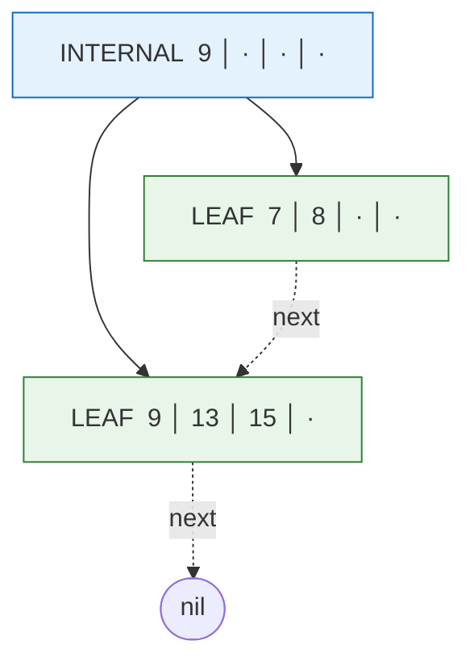
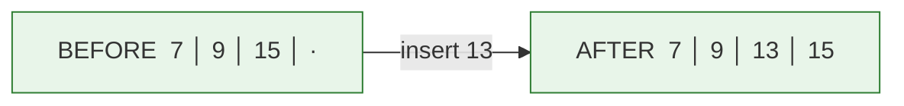
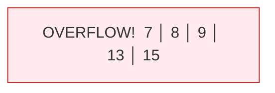
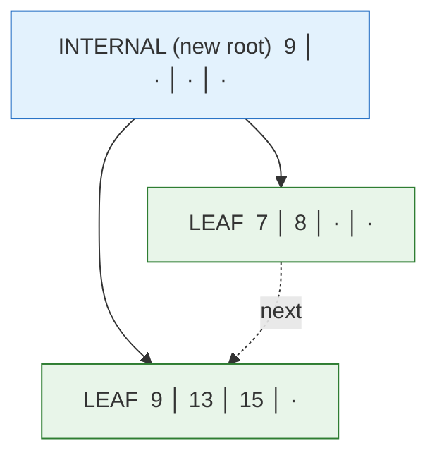

# B+ Tree - Gray team

## What is the structure?

B+ tree is a self-balancing tree that is made for systems that read and write data in big blocks, mainly when the data lives on disk. It is a variation of the B-tree, with one main difference: all the values are stored in the leaf nodes, and the internal nodes only keep keys that are used to navigate the tree.

## What are the pros and cons?

### Pros
- Really good with range queries, because the leaves are sorted and linked together.
- Efficient insertion, O(log n).
- The internal nodes are only keys, which allows shallower trees (more keys per node means fewer disk reads).

### Cons
- Not good for small amounts of keys (< 10 MB)
    - Alternatives: AVL tree, Red-black tree
- Random writes are slower, because of the node splits.
- The implementation is complex.
- Removing elements can be expensive, since the tree may need to rebalance or merge nodes.

## What is the use case for the data structure?
- **Database indexes:** This is the main use case. Almost every relational database uses B+ trees for indexing
- **File systems:** XFS, JFS, Btrfs (the name literally means "B-tree FS") trees to index directories and metadata.

---

A set of B+ tree implementations in Go, built up in stages:

| Package | Description |
| --- | --- |
| [`bplus-tree-mem`](bplus-tree-mem/) | In-memory B+ tree |
| [`bplus-tree-paged`](bplus-tree-paged/) | Persisted to disk (index + data) |
| [`bplus-tree-paged-data`](bplus-tree-paged-data/) | Persisted index and data in separate files |
| [`persist-structs-poc`](persist-structs-poc/) | Proof-of-concept for persisting structs |

## How the B+ tree is structured

A B+ tree is created with an `order`, which is the **maximum number of children** an
internal node may have. From this we derive:

- **max keys per node** = `order - 1`
- a node **overflows** (must split) once it holds `order` keys

Each node is a fixed-size row of slots. The diagrams below draw every slot, using `·` for
an empty one — so a leaf in an `order = 5` tree always has 4 key slots.

Two kinds of nodes:

- **Leaf nodes** store the actual `key → value` pairs and are chained together in a
  singly linked list (`next`), so an ordered scan is just a walk along the leaves.
- **Internal nodes** store only *separator keys* and pointers to children. They route
  searches; they never hold values.



> Routing rule (matches the code): at an internal node, follow child `i` where `i` is the
> first index such that `key < keys[i]`. Equal keys go **right** (`key >= keys[i]` keeps
> advancing). So key `9` lives in the right leaf, not the left one.

The examples below all use **`order = 5`**, meaning **at most 4 keys per node**. A node
splits the moment a 5th key is inserted.

---

## Insertion *without* a split

When the target leaf has a free slot (fewer than `order - 1` keys after insertion), the
key is just placed in sorted position — no structural change.

**Insert `13`** into a leaf that already holds `7 │ 9 │ 15`:



Step by step:

1. Walk from the root down to the leaf that should contain `13`.
2. Binary-search the leaf for the insertion point (`sort.SearchInts`).
3. Shift later keys/values right and drop `13` into the free slot: `7 │ 9 │ 13 │ 15`.
4. The leaf now has 4 keys, which is `≤ order - 1`, so **no split** is needed.

---

## Insertion *with* a split

When inserting would push a leaf to `order` keys (5 here), the leaf overflows and splits:
the keys are divided in half, a new right-hand leaf is created, the leaf linked list is
re-stitched, and the **first key of the new right leaf is copied up** into the parent as a
separator.

**Insert `8`** into a full leaf `7 │ 9 │ 13 │ 15`:

### Step 1 — leaf overflows

`8` is placed in sorted order, temporarily giving the leaf 5 keys (`> order - 1`):



### Step 2 — split the leaf

With `mid = len(keys) / 2 = 2`, the leaf splits into `keys[:2]` and `keys[2:]`. The new
right leaf's first key (`9`) is copied up to become the separator in a brand-new root.



Step by step:

1. Walk down to the target leaf `7 │ 9 │ 13 │ 15` and insert `8` → `7 │ 8 │ 9 │ 13 │ 15`.
2. The leaf now has 5 keys (`> order - 1`), so `splitLeaf` runs with `mid = 5 / 2 = 2`.
3. Left leaf keeps `7 │ 8`; a new right leaf takes `9 │ 13 │ 15`.
4. Fix the linked list: `left.next = right`, `right.next = old next`.
5. **Copy** the right leaf's first key (`9`) up to the parent as a separator.
6. The old leaf was the root, so a new root internal node is created with key `9` and
   children `[left, right]`. The tree grows one level taller.

> Note on **leaf vs. internal splits**: a leaf split **copies** the separator up (the key
> still physically lives in the right leaf). An internal-node split (`splitInternal`)
> **moves** the middle key up — it is removed from the children and only exists in the
> parent.

---

## Running the tests

```sh
cd bplus-tree-mem && go test ./...
```
